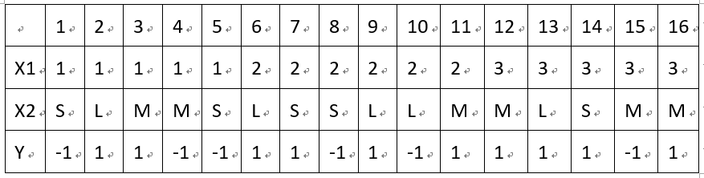

## MachineLearningInAction-Camp
### 9月25日（已完成）
- 任务1题目：观看机器学习实战绪论视频+天池o2o比赛完全流程解析PPT
- 任务详解：第一次视频课主要以《机器学习实战》第一章为基础，主要介绍机器学习的基本概念、算法类型、推荐学习路线和一些预备知识，包括Numpy、Pandas、Matplotlib等Python基本库。还有天池o2o比赛完全流程解析。
- 作业：每个学员注册天池账号，报名参加比赛，提交结果，查看成绩。（结果submit.csv文件提供，学员只需按照直播视频讲述的方法提交查看成绩就好。submit.csv文件已放置在GitHub上）
- 作业提交形式：比赛上传结果界面排名截图打卡上传。

### 9月27日（已完成）
- 任务1题目：配置开发环境，熟悉Jupyter Notebook
- 任务详解：以Python3为开发语言，安装软件Anaconda。Anaconda自带Jupyter Notebook，熟悉Jupyter Notebook的基本用法。
- 参考资料：Jupyter Notebook入门教程上下，csdn博客。
- 作业：使用Jupyter Notebook，对Numpy、Pandas、Matplotlib各写一个小的demo程序。要求是解释性说明和代码相结合的形式。
- 作业提交形式：代码截图打卡提交。

### 9月28日（已完成）
- 任务1：书籍阅读
- 任务详解：阅读《机器学习实战》书籍第二章，2.1、2.2、2.3章节
- 参考资料：李航《统计学习方法》第三章
- 作业1：简要概括k-近邻算法的原理，优缺点。
- 提交日期：9.28
- 提交形式：文字打卡提交或上交.md文件的链接

### 9月30日（已完成）
- 任务2：将本章中“使用k近邻算法改进网站的配对效果”完整代码键入jupyter notebook,并添加详细注释。若有可能，自己可以优化该代码。
- 提交日期：9.30
- 提交形式：代码截图打卡提交或者git链接提交

### 10月1日（已完成）
- 任务3：将本章中“手写识别系统”完整代码键入入jupyter notebook,并添加详细注释。若有可能，自己可以优化该代码。
- 提交日期：10.1
- 提交形式：代码截图打卡提交或者git链接提交

### 国庆选修任务（未完成）
- 阅读以下材料：
- https://blog.csdn.net/red_stone1/article/details/70866527
- 了解掌握线性感知机算法（PLA）的基本原理和算法流程，并使用PLA来解决一个实际的分类问题。
- 本作业是国庆假期的选修作业，学有余力或有时间的同学可以做一做，自己动手写个PLA算法。建议使用jupyter notebook，写出PLA的基本原理和python代码。

### 10月8日（已完成）
- 任务1题目：书籍阅读
- 任务详解：阅读《机器学习实战》书籍第三章3.1、3.3、3.4节（3.2节选做）
- 参考文献：李航《统计学习方法》第5章中的5.1-5.3节
- 作业1：概括决策树分类算法的原理。
- 提交日期：10/08
- 提交形式：文字打卡提交或者上交.md文件的链接
- 作业2：在构建一个决策树模型时，我们对某个属性分割节点，下面四张图中，哪个属性对应的信息增益最大？
- 提交日期：10/08
- 提交形式：文字或者截图打卡提交

### 10月9日（已完成）
- 作业3：将本章中“使用决策树预测隐形眼镜类型”完整代码键入jupyter notebook，并添加详细注释。若有可能，自己可以优化该代码。
- 提交日期：10/09
- 提交形式：代码截图打卡或git链接提交

### 10月11日（已完成）
- 任务1题目：书籍阅读
- 任务详解：阅读《机器学习实战》书籍第四章
- 参考文献：李航《统计学习方法》第4章
- 参考资料：[通俗易懂！白话朴素贝叶斯]
- ( https://mp.weixin.qq.com/s/7xRyZJpXmeB77MZNLqVf3w)
- 作业1：概括朴素贝叶斯分类算法的原理，为什么称之为“朴素”？
- 提交日期：10/11
- 提交形式：文字打卡提交或者上交.md文件的链接
- 作业2：
- 试由下表的训练数据学习一个朴素贝叶斯分类器并确定x=（2,S）的类标记y。表中X1和X2为特征。  

- 提交日期：10/11
- 提交形式：文字或者截图打卡提交

### 10月12日（已完成）
- 作业3：将本章中“使用朴素贝叶斯过滤垃圾邮件”完整代码键入jupyter notebook，并添加详细注释。若有可能，自己可以优化该代码。
- 提交日期：10/12
- 作业提交形式：代码截图打卡或git链接提交

### 10月14日（已完成）
- 作业4：将本章中“使用朴素贝叶斯分类器从个人广告中获取区域倾向”完整代码键入jupyter notebook，并添加详细注释。若有可能，自己可以优化该代码。
- 提交日期：10/14
- 提交形式：代码截图打卡或git链接提交

### 10月15日（已完成）
- 任务1题目：书籍阅读
- 任务详解：阅读《机器学习实战》书籍第5章
- 参考文献：李航《统计学习方法》第6章中的6.1节
- 作业1：写出并解释逻辑回归的损失函数，推导参数w的梯度下降公式。 
- 提交日期：10/15
- 提交形式：文字或者截图打卡

### 10月16日（已完成）
- 作业2：将本章中“从疝气病症预测病马的死亡率”完整代码键入jupyter notebook，并添加详细注释。若有可能，自己可以优化该代码。
- 提交日期：10/16
- 提交形式：代码截图打卡或git链接提交

### 10月18日（已完成）
- 任务1题目：书籍阅读
- 任务详解：阅读《机器学习实战》书籍第6章6.1/6.2/6.3节
- 参考资料：
- 李航《统计学习方法》第7章
- [深入浅出机器学习技法（一）：线性支持向量机（LSVM）]
- ( https://mp.weixin.qq.com/s/Ahvp0IAdgK9OVHFXigBk_Q)
- [深入浅出机器学习技法（二）：对偶支持向量机（DSVM）]
- ( https://mp.weixin.qq.com/s/Q5bFR3vDDXPhtzXlVAE3Rg)

### 10月19日（已完成）
- 作业1：推导SMO算法
- 提交日期：10/19
- 提交形式：文字或者截图打卡

### 10月21日（已完成）
- 作业2：理解书中程序清单6-2的简化SMO算法程序，对程序中详细注释。
- 提交日期：10/21
- 提交形式：文字或者截图打卡

### 10月22日（已完成）
- 任务1题目：书籍阅读
- 任务详解：阅读《机器学习实战》书籍第6章6.4/6.5/6.6节
- 参考文献：
- 李航《统计学习方法》第7章
- [深入浅出机器学习技法（三）：核支持向量机（KSVM）]
- ( https://mp.weixin.qq.com/s/cLovkwwgGJRgSSa1XWZ8eg)

### 10月22日（已完成）
- 作业1：为了防止SVM出现过拟合，应该对参数C进行如何设置？
- 提交日期：10/22
- 提交形式：文字或者截图打卡

### 10月23日（已完成）
- 作业2：将本章中“手写识别问题”完整代码键入jupyter notebook，并添加详细注释。若有可能，自己可以优化该代码。
- 提交日期：10/23
- 提交形式：代码截图打卡或git链接提交

### 10月25日（已完成）
- 任务1题目：阿里云天池o2o优惠券使用预测分析比赛（初级）
- 任务详解：建立一个简单的线性模型，在线提交预测结果，查看成绩
- 视频地址： https://m.weike.fm/lecture/10234967  （观看密码：011220）
- 观看视频，理解竞赛内容。

### 10月26日（已完成）
- 源码文件： https://pan.baidu.com/s/1MQIutT1ALrPETGE1SXy_pQ （提取码：rql8）
- 熟悉代码，构建模型。

### 10月28日（已完成）
- 作业1：使用简单模型，在线提交预测结果，查看成绩
- 提交日期：10/28
- 提交形式：代码截图打卡或git链接提交，比赛上传结果界面排名截图打卡上传

### 10月29日（已完成）
- 任务1题目：书籍阅读
- 任务详解：阅读《机器学习实战》书籍第7章
- 参考文献：
- 李航《统计学习方法》第8章 8.1/8.2/8.3节

### 10月30日（已完成）
- 作业1：AdaBoost选择分类器是弱分类器还是强分类器？解释原因。
- 提交日期：10/29
- 提交形式：文字或者截图打卡

### 11月1日（已完成）
- 作业2：将本章中“在一个难数据集上应用AdaBoost”完整代码键入jupyter notebook，并添加详细注释。若有可能，自己可以优化该代码。
- 提交日期：11/01
- 提交形式：代码截图打卡或git链接提交

### 11月2日（已完成）
- 任务1题目：书籍阅读
- 任务详解：阅读《机器学习实战》书籍第8章
- 作业1：岭回归和Lasso回归有什么区别？
- 提交日期：11/02

### 11月4日（已完成）
- 提交形式：代码截图打卡或git链接提交
- 作业2：将本章中“预测鲍鱼的年龄”完整代码键入jupyter notebook，并添加详细注释。若有可能，自己可以优化该代码。
- 提交日期：11/04
- 提交形式：代码截图打卡或git链接提交

### 11月5日（已完成）
- 任务1题目：书籍阅读
- 任务详解：阅读《机器学习实战》书籍第9章

### 11月6日（未完成）
- 作业1：将本章中“树回归与标准回归的比较”完整代码键入jupyter notebook，并添加详细注释。若有可能，自己可以优化该代码。
- 提交日期：11/08
- 提交形式：代码截图打卡或git链接提交

### 11月8日（未完成）
- 作业2（选做）：将本章中“使用Python的Tkinter库创建GUI”完整代码键入jupyter notebook，并添加详细注释。若有可能，自己可以优化该代码。
- 提交日期：11/08
- 提交形式：代码截图打卡或git链接提交
